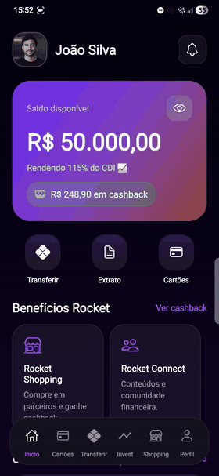
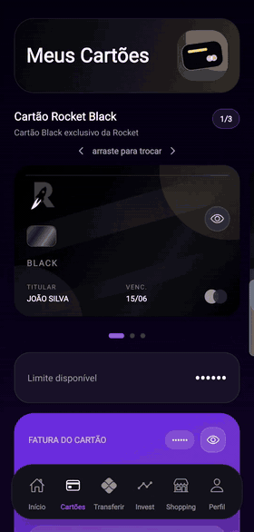
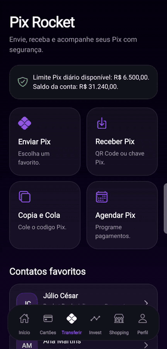
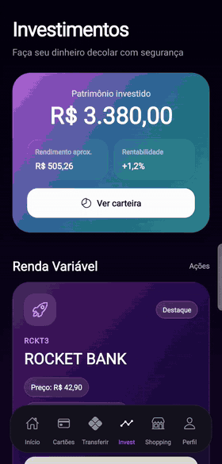

<div align="center">
  

  <h1>Rocket Bank Mobile</h1>

  <p>
    Aplicativo mobile de banco digital desenvolvido com Expo, React Native e TypeScript.
  </p>

  <p>
    <strong>Projeto desenvolvido por Divanildo Simões, Edoardo Famá, César Fraga e Djhonatah Wesley.</strong>
  </p>

  <p>
    Projeto desenvolvido durante a Academia de Java & I.A disponibilizada pela Accenture.
  </p>

  <p>
    
    
    
  </p>
</div>

## Visão geral

O **Rocket Bank Mobile** é um protótipo funcional de banco digital criado para simular uma experiência bancária moderna, visualmente sofisticada e orientada a fluxos reais do usuário. O app reúne autenticação, conta digital, cartões, Pix, investimentos, shopping com cashback, comunidade financeira, suporte, perfil, extrato e pagamento de fatura.

A proposta do projeto é demonstrar uma jornada completa de uso em um app financeiro: o usuário inicia no splash screen, acessa a conta, consulta saldo, movimenta dinheiro, paga faturas, realiza Pix, simula investimentos e acompanha suas transações em tempo real dentro da aplicação.

## Destaques do produto

- Interface mobile com identidade visual própria do Rocket Bank.
- Fluxo de inicialização com animação de foguete.
- Login com e-mail ou CPF, recuperação de acesso e cadastro simulado.
- Tela principal com saldo, cashback, atalhos e últimas movimentações.
- Área de cartões com fatura, limite, cartões cadastrados e pagamento.
- Área Pix com validação de valor, limite diário e registro no extrato.
- Área de investimentos com simulação de aplicação e carteira local.
- Rocket Shopping com compras simuladas e geração de cashback.
- Extrato dinâmico atualizado pelos fluxos financeiros do app.
- Arquitetura em componentes reutilizáveis e telas separadas por domínio.

## Demonstração visual

### 1. Inicialização do projeto

<a href="./docs/media/video-inicializacao.mp4">
  
</a>


O primeiro vídeo apresenta a abertura do aplicativo, destacando a identidade visual da marca e a experiência de splash screen antes do acesso ao app.

### 2. Tela de login

<a href="./docs/media/video-tela-login.mp4">
  
</a>


Este fluxo demonstra a tela de autenticação, com campos para acesso por e-mail ou CPF, senha, opção de lembrar dados, recuperação de senha e login social simulado.

### 3. Tela principal

<a href="./docs/media/video-tela-principal.mp4">
  
</a>

A home concentra as informações essenciais da conta: saldo disponível, rendimento, cashback acumulado, atalhos rápidos, benefícios Rocket e últimas movimentações.

### 4. Aba de cartões e pagamento de fatura

<a href="./docs/media/video-cartoes-fatura.mp4">
  
</a>


Nesta demonstração, o usuário acessa a área de cartões para visualizar os cartões disponíveis, conferir dados da fatura e concluir o pagamento pelo saldo da conta. O fluxo também simula a atualização do estado financeiro do app, registrando a movimentação no extrato e aplicando o cashback referente ao pagamento da fatura.

### 5. Área Pix

<a href="./docs/media/video-area-pix.mp4">
  
</a>


Na área Pix, o usuário realiza uma transferência usando o saldo disponível. O fluxo valida o valor informado, respeita o limite diário configurado e registra a transação no extrato após o envio.

### 6. Área de investimento

<a href="./docs/media/video-area-investimento.mp4">
  
</a>


Nesta demonstração, o usuário acessa a área de investimentos para consultar opções disponíveis, visualizar informações de rendimento e simular uma aplicação usando o saldo da conta. O fluxo atualiza a carteira local do usuário e registra a movimentação financeira no extrato.

## Funcionalidades

| Módulo | Descrição |
| --- | --- |
| Splash | Exibe a animação inicial e prepara a entrada no app. |
| Login | Permite autenticação simulada, cadastro e recuperação de acesso. |
| Home | Mostra saldo, rendimento, cashback, atalhos e movimentações recentes. |
| Cartões | Lista cartões, exibe fatura e permite simular pagamento. |
| Pix | Realiza transferência simulada com validação de saldo e limite diário. |
| Investimentos | Apresenta ativos, rendimento estimado e aplicação simulada. |
| Shopping | Simula compra em parceiros com cashback. |
| Cashback | Mostra o saldo acumulado de benefícios. |
| Comunidade | Direciona para conteúdos e comunidade financeira. |
| Perfil | Centraliza informações da conta e logout. |
| Extrato | Reúne entradas, saídas, pagamentos e cashback gerados pelos fluxos. |

## Tecnologias

- **TypeScript/TSX** como linguagem principal do código-fonte.
- **JSON** para configurações do Expo, TypeScript e dependências.
- **Markdown** para documentação do projeto.
- **Expo 54** para execução e empacotamento do app.
- **React 19** como base da interface.
- **React Native 0.81** para construção mobile multiplataforma.
- **Expo Linear Gradient** para os efeitos visuais dos cards.
- **Expo Vector Icons** para a iconografia da interface.
- **Lottie React Native** para a animação de inicialização.

> Observação: a barra de linguagens do GitHub é calculada automaticamente pelo GitHub Linguist. Como o código do aplicativo está majoritariamente em arquivos `.ts` e `.tsx`, é esperado que TypeScript apareça como a linguagem predominante. React Native e Expo são frameworks/ferramentas, não linguagens de programação.

## Arquitetura do projeto

```text
.
|-- assets/
|   |-- animations/
|   `-- images/
|-- docs/
|   `-- media/
|-- src/
|   |-- components/
|   |-- data/
|   |-- screens/
|   |-- theme/
|   |-- types/
|   `-- utils/
|-- App.tsx
|-- app.json
|-- index.ts
`-- package.json
```

### Organização das pastas

- `assets/animations`: animações usadas na experiência inicial.
- `assets/images`: imagens, marcas, banners e recursos visuais da aplicação.
- `docs/media`: vídeos, print e logo usados nesta documentação.
- `src/App.tsx`: estado principal, fluxo de splash, login e navegação entre telas.
- `src/components`: componentes reutilizáveis da interface.
- `src/data`: dados mockados de cartões, produtos e faturas.
- `src/screens`: telas completas do aplicativo.
- `src/theme`: cores, medidas e estilos compartilhados.
- `src/types`: tipos globais utilizados pelo app.
- `src/utils`: funções auxiliares, como formatação de moeda.

## Fluxos financeiros simulados

O app não possui backend. Todas as operações acontecem em estado local para demonstrar a experiência do produto:

- Pagamento de fatura debita o saldo da conta.
- Cashback da fatura é calculado e adicionado ao saldo de benefícios.
- Pix enviado reduz o saldo e respeita o limite diário.
- Investimentos debitam o saldo e atualizam a carteira local.
- Compras no Rocket Shopping geram movimentações e cashback.
- O extrato é atualizado automaticamente com as operações realizadas.

## Como executar

Instale as dependências:

```bash
npm install
```

Inicie o servidor Expo:

```bash
npm start
```

Depois, escolha a plataforma desejada:

```bash
npm run android
npm run ios
npm run web
```

Para testar em um dispositivo físico, abra o **Expo Go** e leia o QR Code exibido no terminal.

## Scripts disponíveis

| Comando | Finalidade |
| --- | --- |
| `npm start` | Inicia o servidor Expo. |
| `npm run android` | Executa o app em Android. |
| `npm run ios` | Executa o app em iOS, apenas em ambiente macOS. |
| `npm run web` | Executa o app no navegador. |
| `npm run typecheck` | Valida os tipos TypeScript com `tsc --noEmit`. |

## Padrão de desenvolvimento

Os arquivos `.tsx` seguem uma organização simples e previsível:

```text
1. Imports
2. Constantes, tipos e funções auxiliares
3. Componente principal e regras de interação
4. Estilos agrupados no final com StyleSheet.create
```

Esse padrão facilita a leitura do comportamento antes da camada visual e ajuda a manter telas e componentes mais fáceis de evoluir.

## Validação

Antes de finalizar alterações, execute:

```bash
npm run typecheck
```

## Status do projeto

Protótipo acadêmico e demonstrativo, com dados mockados e fluxos locais. O projeto está preparado para evoluir com autenticação real, persistência de dados, integração com APIs bancárias simuladas e testes automatizados.
